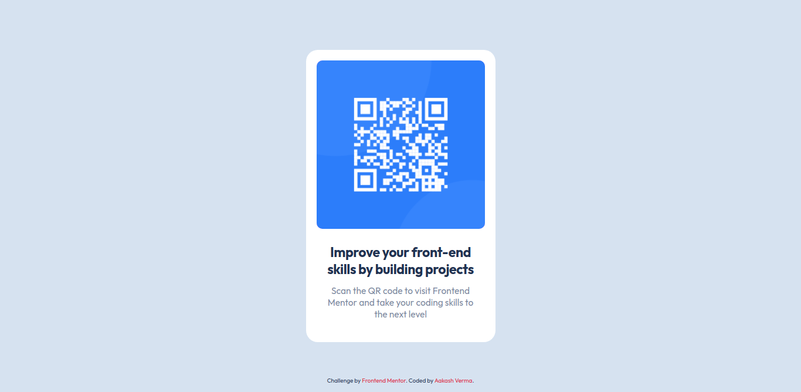

### Links

- Solution URL: [Github]()
- Live Site URL: [Git Pages]()

<a name="readme-top"></a>

<!--
!!! IMPORTANT !!!
This README is an example of how you could professionally present your codebase. 
Writing documentation is a crucial part of your work as a professional software developer and cannot be ignored. 

You should modify this file to match your project and remove sections that don't apply.

REQUIRED SECTIONS:
- Table of Contents
- About the Project
  - Built With
  - Live Demo
- Getting Started
- Authors
- Future Features
- Contributing
- Show your support
- Acknowledgements
- License

OPTIONAL SECTIONS:
- FAQ

After you're finished please remove all the comments and instructions!

For more information on the importance of a professional README for your repositories: https://github.com/microverseinc/curriculum-transversal-skills/blob/main/documentation/articles/readme_best_practices.md
-->

<div align="center">
  <!-- You are encouraged to replace this logo with your own! Otherwise you can also remove it. -->
  
  <br/>

  <h3><b>QR Code Component</b></h3>

</div>

<!-- TABLE OF CONTENTS -->

# 📗 Table of Contents

- [📖 About the Project](#about-project)
  - [🛠 Built With](#built-with)
    - [Tech Stack](#tech-stack)
    - [Key Features](#key-features)
  - [🚀 Live Demo](#live-demo)
- [💻 Getting Started](#getting-started)
  - [Prerequisites](#prerequisites)
  - [Setup](#setup)
  - [Install](#install)
  - [Usage](#usage)
  - [Run tests](#run-tests)
  - [Deployment](#deployment)
- [👥 Authors](#authors)
- [🔭 Future Features](#future-features)
- [🤝 Contributing](#contributing)
- [⭐️ Show your support](#support)
- [🙏 Acknowledgements](#acknowledgements)
- [❓ FAQ (OPTIONAL)](#faq)
- [📝 License](#license)

<!-- PROJECT DESCRIPTION -->

# 📖 QR Code Component <a name="about-project"></a>

**QR code component** is a vanilla js application built with HTML5, CSS3 using flexbox to learn web development.

## 🛠 Built With <a name="built-with"></a>

### Tech Stack <a name="tech-stack"></a>

<details>
  <summary>Client</summary>
  <ul>
    <li><a href="https://html.com/">HTML</a></li>
    <li><a href="https://developer.mozilla.org/en-US/docs/Web/CSS">CSS</a></li>
  </ul>
</details>

<!-- Features -->

### Key Features <a name="key-features"></a>

- **Semantic HTML5 markup**
- **CSS custom properties**
- **Flexbox**
- **Mobile-first workflow**

<p align="right">(<a href="#readme-top">back to top</a>)</p>

<!-- LIVE DEMO -->

## 🚀 Live Demo <a name="live-demo"></a>

- [Live Project](https://skyv26.github.io/QrCode-Component/)

<p align="right">(<a href="#readme-top">back to top</a>)</p>

<!-- GETTING STARTED -->

## 💻 Getting Started <a name="getting-started"></a>

To get a local copy up and running, follow these steps.

### Prerequisites

In order to run this project you need:

```
To do this challenge, you need a basic understanding of HTML, CSS and JavaScript.
```

### Setup

Clone this repository to your desired folder:

```sh
  cd DESIRED_FOLDER
  git clone https://github.com/skyv26/QrCode-Component.git
```
### Usage

```
Please use the VSCode and with the help of live
server extension run it directly.
```

### Deployment

```
You can deploy this project using gh-pages or other platforms like vercel.
```

<p align="right">(<a href="#readme-top">back to top</a>)</p>

<!-- AUTHORS -->

## 👥 Authors <a name="authors"></a>

👤 **Aakash Verma**

- GitHub: [@skyv26](https://github.com/skyv26)
- Twitter: [@vrma_aakash](https://twitter.com/vrma_aakash)
- LinkedIn: [skyv2022](https://linkedin.com/in/skyv2022)
- Frontend Mentor: [@skyv26](https://www.frontendmentor.io/profile/skyv26)

<p align="right">(<a href="#readme-top">back to top</a>)</p>

<!-- FUTURE FEATURES -->

## 🔭 Future Features <a name="future-features"></a>

- [ ] **[new_feature_1]**
- [ ] **[new_feature_2]**
- [ ] **[new_feature_3]**

<p align="right">(<a href="#readme-top">back to top</a>)</p>

<!-- CONTRIBUTING -->

## 🤝 Contributing <a name="contributing"></a>

Contributions, issues, and feature requests are welcome!

Feel free to check the [issues page](../../issues/).

<p align="right">(<a href="#readme-top">back to top</a>)</p>

<!-- SUPPORT -->

## ⭐️ Show your support <a name="support"></a>

If you like this project, please support me by giving a star.

<p align="right">(<a href="#readme-top">back to top</a>)</p>

<!-- ACKNOWLEDGEMENTS -->

## 🙏 Acknowledgments <a name="acknowledgements"></a>

I would like to thank [Frontend Mentor](https://www.frontendmentor.io) 

<p align="right">(<a href="#readme-top">back to top</a>)</p>

<!-- LICENSE -->

## 📝 License <a name="license"></a>

This project is [MIT](./LICENSE) licensed.

<p align="right">(<a href="#readme-top">back to top</a>)</p>